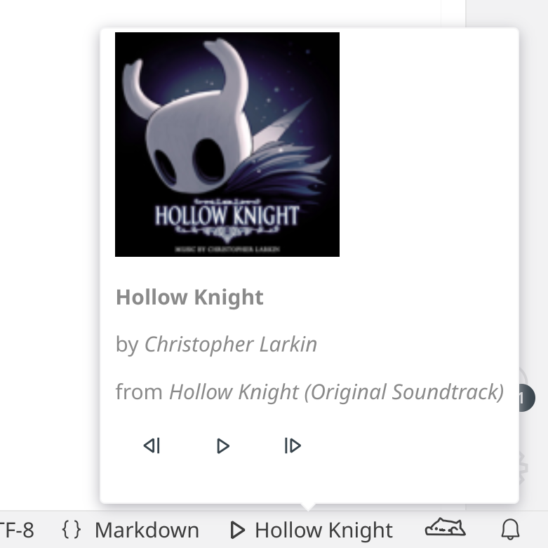

# MPRIS Media Control for VS Code

<figure align="center">

</figure>

An extension for VS Code to control various media players via MPRIS protocol.

- See the track title with a glance
- Hover over the status bar to see the art, album, and artist
- Control the media player directly from VS Code

## Getting Started

### Prerequisites

This project requires VS Code to function.

It uses D-Bus and MPRIS, so only some platforms and media players are supported. See [MPRIS on ArchWiki](https://wiki.archlinux.org/title/MPRIS) for more information.

Additionally, building from source requires Node.JS v20 or later.

### Installation

Via VS Code Marketplace: [MPRIS Media Control on VS Code Marketplace](https://marketplace.visualstudio.com/items?itemName=esdmr.mpctl).

Via GitHub Releases: [MPRIS Media Control Releases](https://github.com/esdmr/vscode-mpctl/releases).

Build from source:

1. **Clone the repository:**

    ```sh
	git clone https://github.com/esdmr/vscode-mpctl
	```
2. **Navigate to the project directory:**

    ```sh
	cd vscode-mpctl
	```
3. **Install the dependencies:**

    ```sh
	corepack pnpm i --prod
	```
4. **Bundle the source code:**

    ```sh
	corepack pnpm run bundle
	```
5. **Package the extension:**

    ```sh
	corepack pnpm run package --out ./mpctl.vsix
	```
6. **Install the extension package:**

    ```sh
	code --install-extension ./mpctl.vsix
	```

### Usage

The extension will provide the following:

- A status bar showing the title
- A tooltip showing the art, title, artist, album, and some control buttons
- Several commands to control the player: play, pause, next, previous, stop
- A command to switch the player
- A command to reconnect to D-Bus

## License

This project is provided under the MIT license. Please see the `LICENSE` file for details.
